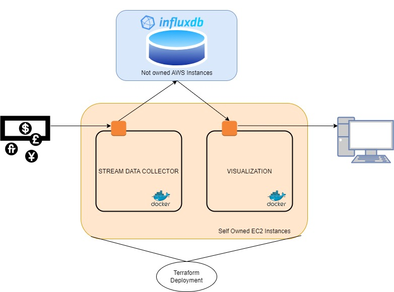

# Development of an AWS hosted Currency Trading Platform

## Big Data Technologies (CSP 554)

### Miguel Cozar Tramblin A20522001


The system design proposed is as per Figure below. It has two Docker modules interacting with
another cloud hosted time series database. The stream collector collects a constant flux
of data and stores it on and InfluxDB time series database. The visualization container
is a python flask server answering requests querying the database. All the deployment is
automated with two Terraform files.



### **To launch the whole infrastructure**

#### Prerequisites

- Have an AWS account with access and secret key
- Create a Key pair and name it emr-key-pair.pem
- Download your key and place it in directory _automated_deployment_
- Create an InfluxDB token and paste it in config.py

#### Launch the platform

Perform this set of commands
```
python3 config.py
cd automated_deployment
terraform init
terraform apply
```

Et voilà! Your whole infrastructure is created and working on an EC2 AWS instance, in two docker containers and communicating with a time series database

#### Demo

See https://www.youtube.com/watch?v=sa7YtWgeE5E&ab_channel=MiguelCozar to watch a full video of the deployment.

